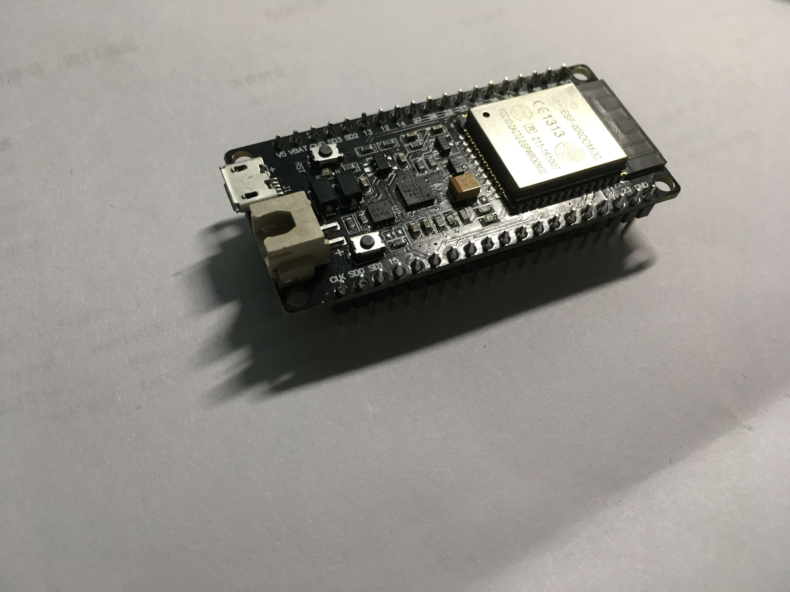

# ESP32 Tutorial

This is a tutorial about how to begin ESP32 development using MicroPython with GeeekPi's  ESP Kit.

You can also read [the official document](http://docs.micropython.org/en/latest/esp8266/) for Micropython running on ESP8266.

It is an experimental port of MicroPython to the Espressif ESP32 microcontroller. It uses the ESP-IDF framework and MicroPython runs as a task under FreeRTOS.

Supported features include:

- REPL (Python prompt) over UART0.
- 16k stack for the MicroPython task and 96k Python heap.
- Many of MicroPython's features are enabled: unicode, arbitrary-precision integers, single-precision floats, complex numbers, frozen bytecode, as well as many of the internal modules.
- Internal filesystem using the flash (currently 2M in size).
- The machine module with GPIO, UART, SPI, software I2C, ADC, DAC, PWM, TouchPad, WDT and Timer.
- The network module with WLAN (WiFi) support.

## ESP32

